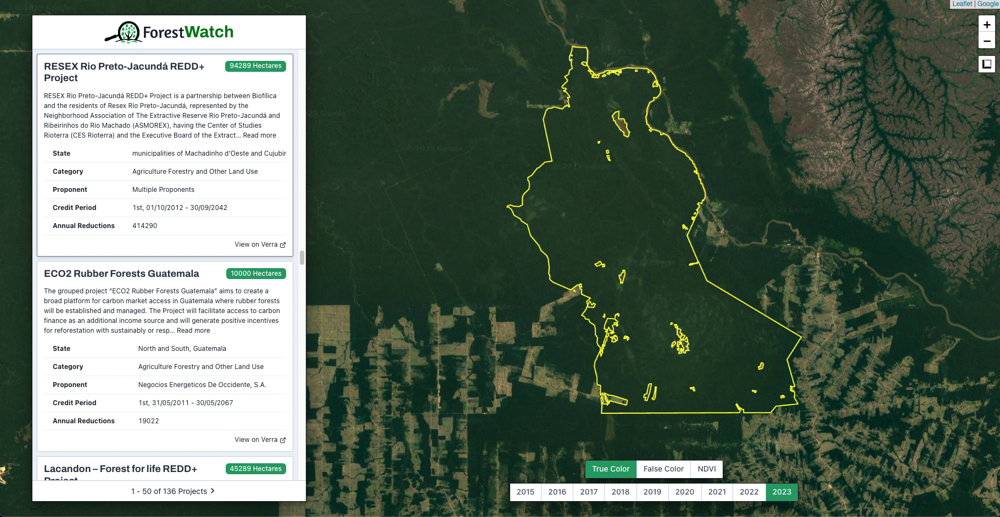
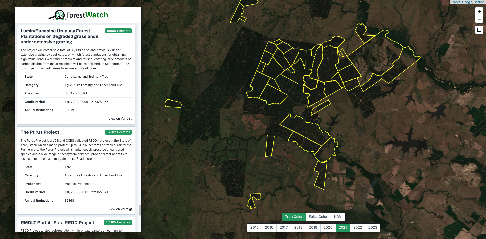
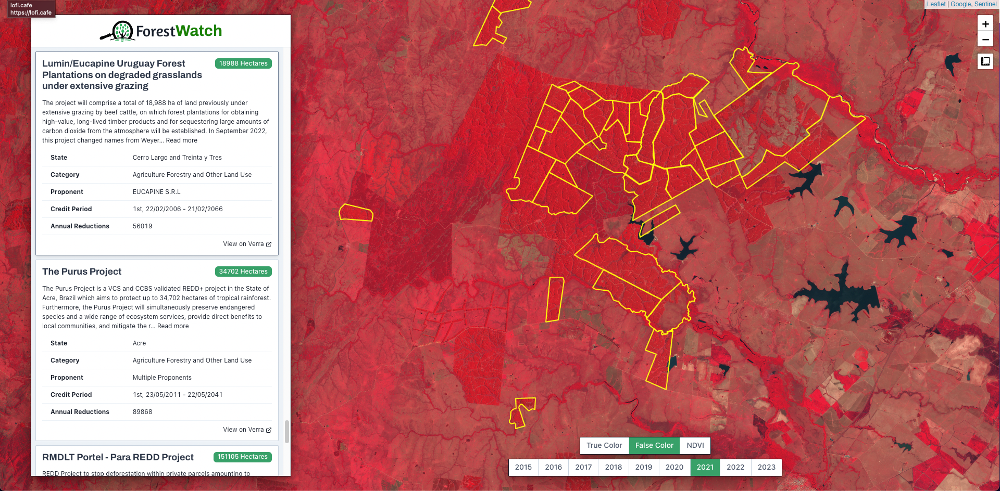
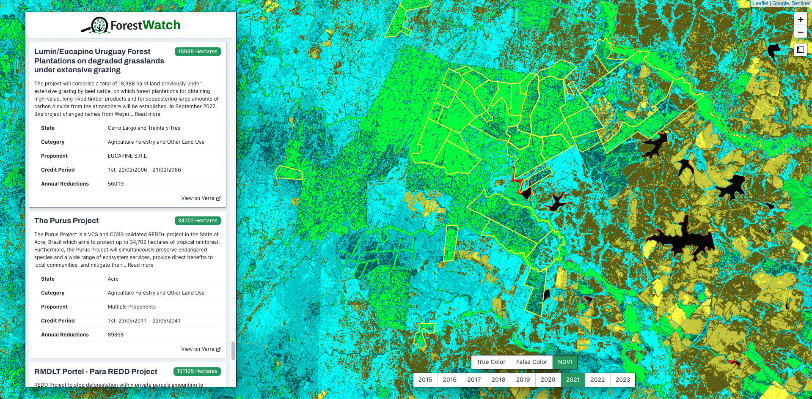

# Forest-Watch
ForestWatch is a web app that allows users to monitor forest-related carbon offset projects using satellite imagery.

The app displays the details and geographic boundaries of various reforestation projects within a map interface. Historical satellite imagery can be overlaid on the map to explore land-cover changes through time.

Users can verify whether a project's offset goals are being achieved by observing changes to the tree coverage occurring inside the project's boundaries.

Read a full project overview [here](https://devpost.com/software/forestwatch). 

## Demo Video
[](https://youtu.be/IdJaMZ59OuM "ForestWatch Demo")

## Setup
Node.js is required to run this application. 

Begin by cloning this repository and installing the required Node packages: 

```bash
# Clone this repository
git clone https://github.com/rhammell/forest-watch.git

# Navigate into the repository
cd forest-watch

# Install required node packages
npm install
```

## Configuration

Developer-specific settings are required for interacting with CO2.Storage, IPFS, and imagery providers. These settings must be defined as environment variables within an `.env` file in the root directory.

Copy the included `.env.example` template file as `.env`: 

```bash
# Copy the environment variables template
cp .env.example .env
```

Update the `.env` file by replacing the default variable values with your unique developer values. The required variables are described below: 

| Variable                   | Description                                                                              |
|----------------------------|------------------------------------------------------------------------------------------|
| ESTUARY_API_KEY            | Estuary API Key. Available within [CO2.Storage](https://co2.storage/).                   |
| FG_TOKEN                   | Filecoin Green API Key. Available with [CO2.Storage](https://co2.storage/).              |
| INFURA_API_KEY             | Infura API Key. Available with [Infura](https://www.infura.io/).                         |
| PK                         | Private wallet key. Exportable from wallet application.                                  |
| REACT_APP_SENTINEL_HUB_KEY | Sentinel Hub Key. Available with [Sentinel Hub](https://www.sentinel-hub.com/).          |
| REACT_APP_IPFS_API_HOST    | IPFS Node URL with API access                                                            |
| REACT_APP_IPFS_GATEWAY_HOST| IPFS Node URL with Gateway access                                                        |

## Web App
Start a local development server to launch the app:

```bash
# Start development server
npm start
```

Open a browser and navigate to `http://localhost:3002/` to view the web interface.

## Usage

The app interface is comprised of two main components: a project menu and map.

The menu lists project data obtained from CO2.Storage. The app queries CO2.Storage for assets created with the ForestWatch template, which includes project details such as name, description, registry, and boundary polygons.

<div align="center">
  <div>
      
  </div>
  <p>ForestWatch UI</p>
</div>

The map displays the boundary polygons for each of the listed projects. Users can pan, zoom, and measure acreage using the map tools, as well as select the year and product type of the satellite imagery to display.

False-Color and NDVI products visually highlight vegetation within imagery, making it easier for users to observe the presence of trees.

<div align="center">
  <div>
    
    
    
  </div>
  <p>True-Color, False-Color, and NDVI imagery examples</p>
</div>

Projects can be explored by either clicking a menu item or clicking a map polygon. Both actions will scroll the menu list to the selected project's details, and center the map on the project's boundary.

Users can read the selected project's description to determine its carbon offset goals, which may include reforesation or afforestation efforts.

Map controls are used to explore satellite imagery covering the project's territory over the span of many years. By tracking changes in tree cover between images, users can verify that a project's goals are being achieved.

## CO2.Storage
Carbon offset project data is stored on CO2.Storage in the form of assets.

A ForestWatch CO2.Storage template provides the structured schema for these assets, defining the data fields that all assets of this type are required to have. An example of the ForestWatch template is available [here](https://explore.ipld.io/#/explore/bafyreigr5mvb6g5sm2mbp3n6jgytbwcllmejc3puizylpzbmh2zbon7p2i). 

Among other project-specific fields like name, description, and registry information, the template requires a `GeoCID` string value for each asset. This CID must reference the GeoJSON polygon for the project's boundary, stored separately on IPFS.

Create a new version of this template on CO2.Storage with the following command: 

```bash
# Create new ForestWatch template on C02.Storage
npm run create_template
```

## Verra Data Processing
[Verra.org](https://verra.org/) is a registry of carbon offset projects that can be utilized by ForestWatch.

Download Verra project data locally with the following command: 

```bash
# Download project data from Verra.org
npm run get_assets
```

This will search Verra for forest-related projects, which also include KML files defining a project boundary. The process converts each KML to GeoJSON and stores the project data within `data_processing/assets`. 

Upload the Verra project data to C02.Storage with the following command: 

```bash
# Upload project data as assets on C02.Storage
npm run upload_assets
```

This command utilizes the C02.Storage JS-API to programmatically add the Verra project data as assets on C02.Storage. The API upload process uses the CID of the ForestWatch template already created on C02.Storage to ensure that all assets include the required data fields.

An example Verra asset can be viewed [here](https://explore.ipld.io/#/explore/bafyreihr4qhwiuoaab5rhwao5xjqtajffybdkypcuq7vruqzsdrp5v7nny).


