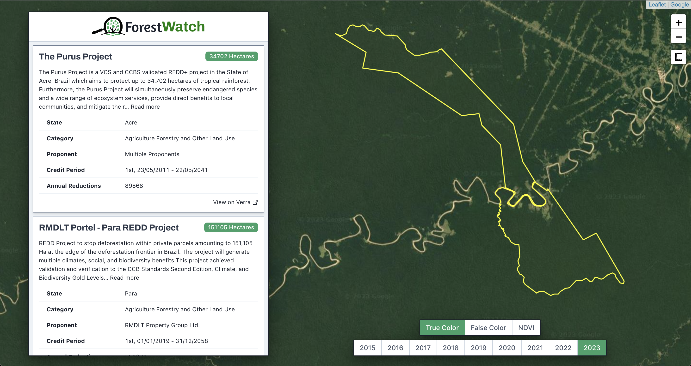

# Forest-Watch
Forest-watch is a web app that allows users to observe and monitor forest-related carbon offset projects using satellite imagery.

The app displays the details and geographic outlines of various afforestation, reforestation, and revegetation projects within a map interface. Users can overlay historical satellite imagery on the map to view land-cover changes through time, allowing for verification that a project's defined goals are being accomplished.

Project data is stored on [CO2.Storage](https://co2.storage/) as assets that conform to a ForestWatch template. This repository includes scripts for building this template, gathering project data from Verra.org, and uploading the data to co2.storage. 

## Setup
Node.js is required to run this application. 

Begin by cloning this repository and installing the required Node packages: 

```bash
# Clone this repository
git clone https://github.com/rhammell/forest-watch.git

# Navigate into the repository
cd forest-watch

# Install required node packages
npm install
```

## Configuration

Developer specific settings are required for interacting with co2.storage, IPFS, and imagery providers. These settings must be defined as environment variables within an `.env` file in the root directory.

Copy the included `.env.example` template file as `.env`: 

```bash
# Copy the environment variables template
cp .env.example .env
```

Update the `.env` file by replacing the default variable values with your unique developer values. The required variables are described below: 

| Variable                          | Description                                                                       |
|-----------------------------------|-----------------------------------------------------------------------------------|
| ESTUARY_API_KEY            | Estuary API Key. Available within [CO2.Storage](https://co2.storage/).                   |
| FG_TOKEN                   | Filecoin Green API Key. Available with [CO2.Storage](https://co2.storage/).              |
| INFURA_API_KEY             | Infura API Key. Available with [Infura](https://www.infura.io/).                         |
| PK                         | Private wallet key. Exportable from wallet application.                                  |
| REACT_APP_SENTINEL_HUB_KEY | Sentinel Hub Key. Available with [Sentinel Hub](https://www.sentinel-hub.com/).          |

## Web App
Start a local development server to launch the app:

```bash
# Start development server
npm start
```

Open a browser and navigate to `http://localhost:3002/` to view the web interface.

## Usage

The app interface is comprised of two main components, a project menu and map:

<p align="center">
  
</p>

The menu lists project data obtained from CO2.storage. When the app loads, it queries CO2.Storage for project assets created with the ForestWatch template. Details such as name, description, registry, and project hectares are included for each project. 

The map displays all the geographic boundary polygons for the listed projects. It includes controls for panning, zooming, measuring acreage, and controlling satellite image layers. 

Projects can be explored by either clicking a menu item or map polygon. This will scoll the menu to highlight selected project's details, and center the map on the corresponding boundary polygon.

Select buttons along the bottom of the map allow user to choose the date range and format of satellite imagery to display. 


## Data Processing